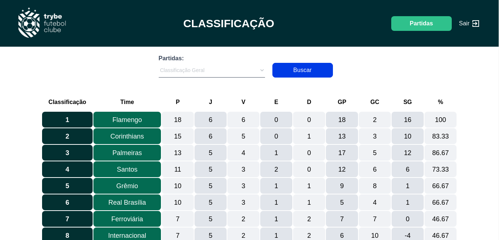

# TFC



# Contexto
Este projeto trata-se de um site informativo de partidas e classificações de futebol! :soccer:

## Técnologias usadas

Front-end:
> Desenvolvido pela Trybe!

Back-end:
> Desenvolvido usando: NodeJS, ExpressJS, MYSQL, TypeScript, Sequelize, sinon, mocha


## Para rodar a aplicação

- :warning: Necessário ter o [Docker](https://docs.docker.com/) instalado na máquina!!

```bash
git clone git@github.com:Vitosoaresp/trybe-futebol-club.git
cd trybe-futebol-club
npm run compose:up
``` 
- Front-end rodará em http://localhost:3000/

## Executando Testes

- Entre dentro do container 

  ```
    docker exec -it app_backend sh
  ```
  
- Para rodar os testes:
  ```
    npm run test
  ```
 
